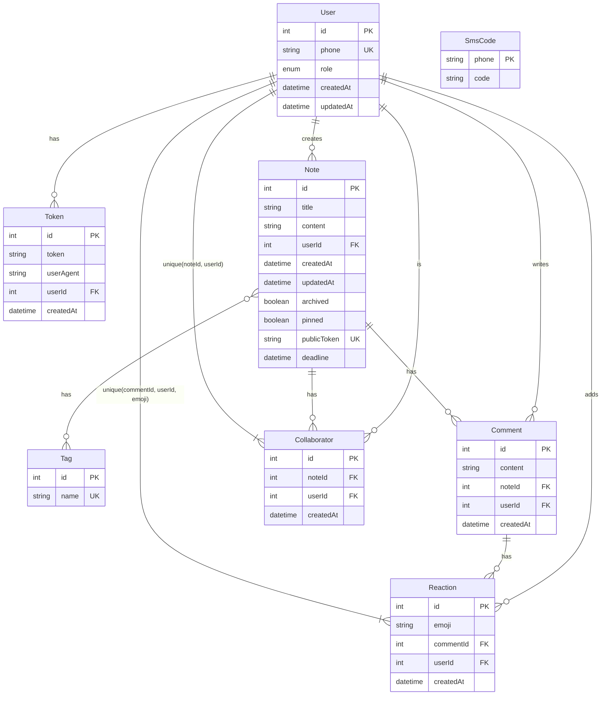

# ER Диаграмма базы данных Notes API

## Описание сущностей

### User (Пользователь)

- **id**: Уникальный идентификатор пользователя
- **phone**: Номер телефона (уникальный)
- **role**: Роль пользователя (user, admin, manager)
- **createdAt/updatedAt**: Временные метки

### Token (Токен авторизации)

- **id**: Уникальный идентификатор токена
- **token**: JWT токен
- **userAgent**: Информация о браузере
- **userId**: Ссылка на пользователя
- **createdAt**: Время создания токена

### Note (Заметка)

- **id**: Уникальный идентификатор заметки
- **title**: Заголовок заметки
- **content**: Содержимое заметки
- **userId**: Автор заметки
- **archived**: Архивная заметка
- **pinned**: Закрепленная заметка
- **publicToken**: Токен для публичного доступа
- **deadline**: Дедлайн заметки
- **createdAt/updatedAt**: Временные метки

### Tag (Тег)

- **id**: Уникальный идентификатор тега
- **name**: Название тега (уникальное)

### Comment (Комментарий)

- **id**: Уникальный идентификатор комментария
- **content**: Содержимое комментария
- **noteId**: Ссылка на заметку
- **userId**: Автор комментария
- **createdAt**: Время создания

### Reaction (Реакция)

- **id**: Уникальный идентификатор реакции
- **emoji**: Эмодзи реакции
- **commentId**: Ссылка на комментарий
- **userId**: Пользователь, поставивший реакцию
- **createdAt**: Время создания
- **Уникальное ограничение**: (commentId, userId, emoji)

### Collaborator (Коллаборатор)

- **id**: Уникальный идентификатор записи
- **noteId**: Ссылка на заметку
- **userId**: Ссылка на пользователя-коллаборатора
- **createdAt**: Время добавления
- **Уникальное ограничение**: (noteId, userId)

### SmsCode (SMS код)

- **phone**: Номер телефона (PK)
- **code**: Код подтверждения

## Ключевые особенности

1. **Много-ко-многим связи**: Notes ↔ Tags, Notes ↔ Collaborators
2. **Уникальные ограничения**: предотвращают дублирование реакций и коллабораторов
3. **Публичный доступ**: через publicToken в Note
4. **Архивация и закрепление**: булевы поля в Note
5. **Дедлайны**: опциональное поле deadline в Note
6. **Аудит**: временные метки для всех основных сущностей
